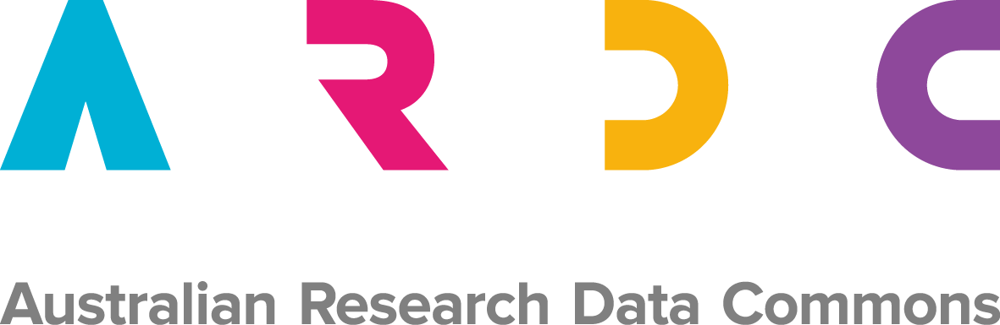

# ReDPository

A simple, scalable and secure file-based repository for research data.

Research datasets are stored in a filesystem, using the [Oxford Common File Layout](https://ocfl.io/), an open standard for building immutable, versioned repositories.

The ReDPository platform will use OCFL repositories to store:

* collections of disparate datasets, ie an institutional data publications repository
* special-purpose repositories for individual research groups or users
* repositories for storing a single, structured research data collection

Datasets are described with [RO-Crate](https://researchobject.github.io/ro-crate/), an open standard for human- and machine-readable metadata, which can capture files, creators, workflows, provenance, licences for access and other contextual metadata.

Metadata and access conditions are harvested and indexed into Solr, a stable, efficient, open-source search engine.

A simple single-page web application provides a faceted discovery interface.

An extension to the open-source web server nginx provides fast delivery of datasets with integrated access control based on licences.

ReDBox 2, an open-source research data management and planning tool, can publish datasets directly to ReDPository.

## Code

* [ocfl-js - a Node library for building and updating OCFL repositories](https://github.com/UTS-eResearch/ocfl-js)
* [ro-crate-js - a Node library for working with RO-Crates](https://github.com/UTS-eResearch/ro-crate-js)
* [ocfl-nginx - an extension to nginx allowing it to serve versioned OCFL content](https://github.com/UTS-eResearch/ocfl-nginx)
* [a Docker image for ocfl-nginx](https://cloud.docker.com/u/mikelynch/repository/docker/mikelynch/nginx-ocfl)
* [solr-catalog - a Node library for indexing an OCFL repository into a Solr index](https://code.research.uts.edu.au/eresearch/solr-catalog)
* [data-portal - a single-page application for searching a Solr index](https://code.research.uts.edu.au/eresearch/data-portal)
* [ReDBox 2 - open-source integrated research data management and publication platform](https://github.com/redbox-mint/redbox-portal)
* [redbox-ro-crate - a Node library for crosswalking ReDBox 2 data publications to RO-Crates](https://code.research.uts.edu.au/960700/datacrate)

## Further reading

* [Oxford Common File Layout](https://ocfl.io/)
* [RO-Crate](https://researchobject.github.io/ro-crate/)
* [Slides from the UTS presentation at the ARDC Data and Services Summit, Monday October 21st 2019](docs/ARDC_Summit_20191021_UTS.pptx)
* [Poster from the ARDC Summit](docs/ARDC_Summit_20191021_UTS_poster.pdf)
* [Lightning Talk: Publishing Versioned Datasets with OCFL and nginx, eResearch 2019](docs/eResearch2019_lighting_ocfl_nginx.pptx)

## Acknowledgements

This research/project is supported by the Australian Research Data Commons (ARDC). The ARDC is enabled by NCRIS.

